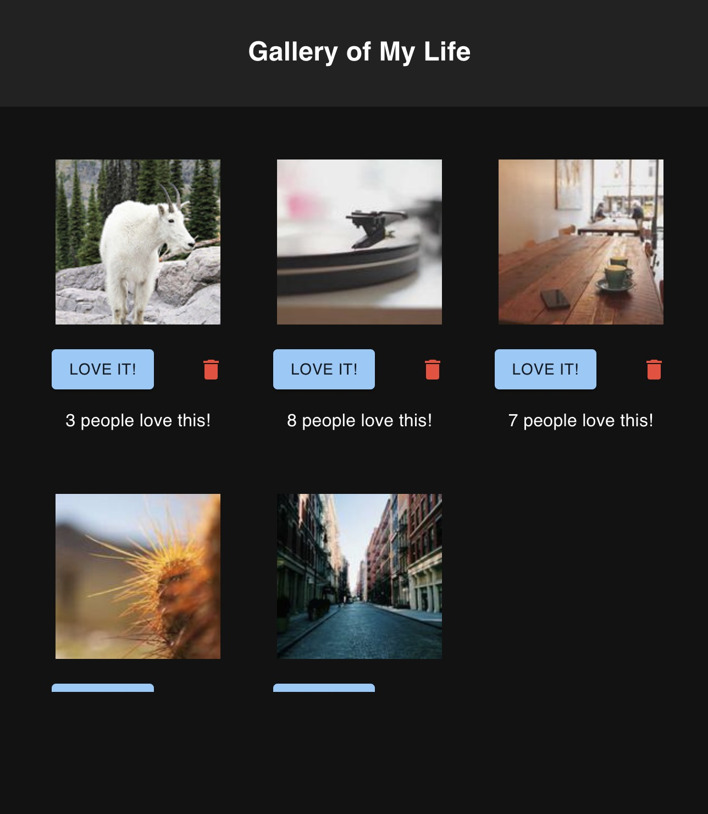

# Weekend React Gallery

## Description

_Duration: Weekend Sprint_

This application displays a list of images from a database. The user can scroll through them and like or delete the images and the database will be updated.

## Screen Shot

### Prerequisites

- [Node.js](https://nodejs.org/en/)

## Installation

1. Create a database named `react_gallery`
2. The queries in the `database.sql` file are set up to create all the necessary tables and populate the needed data to allow the application to run correctly. The project is built on [Postgres](https://www.postgresql.org/download/), so you will need to make sure to have that installed. Recommend using Postico to run the queries as that was used to create the queries. 
3. Open up your editor of choice and run `npm install`
4. Run `npm run server` in your terminal
5. Run `npm run client` in your terminal
6. The `npm run client` command will open up a new browser tab for you!

## Technologies
React, Node, Material-UI, Javascript, HTML/CSS, PostgreSQL
